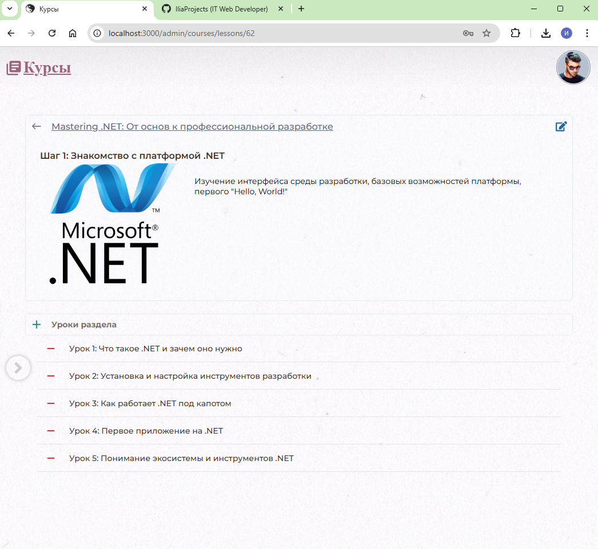
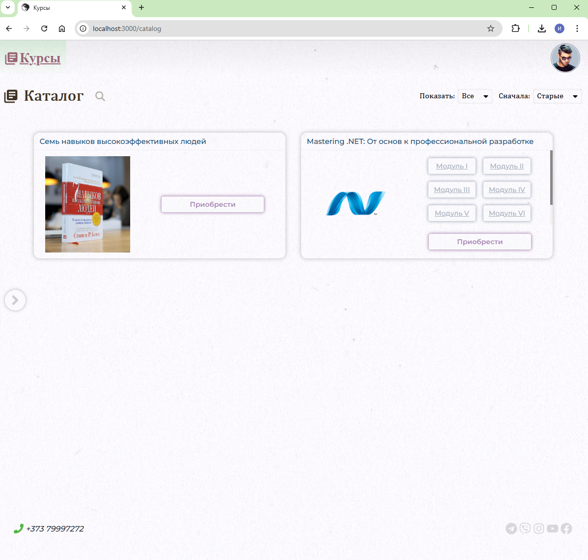

# Courses
I am pleased to present my inaugural project developed using React and ASP.NET Core. This is a compact Learning Management System (LMS) where the frontend is built with pure React, and the backend is an API developed with ASP.NET Core, utilizing PostgreSQL as the database and Entity Framework. The system includes an administrator role, enabling the upload of lessons and granting access to regular users.

